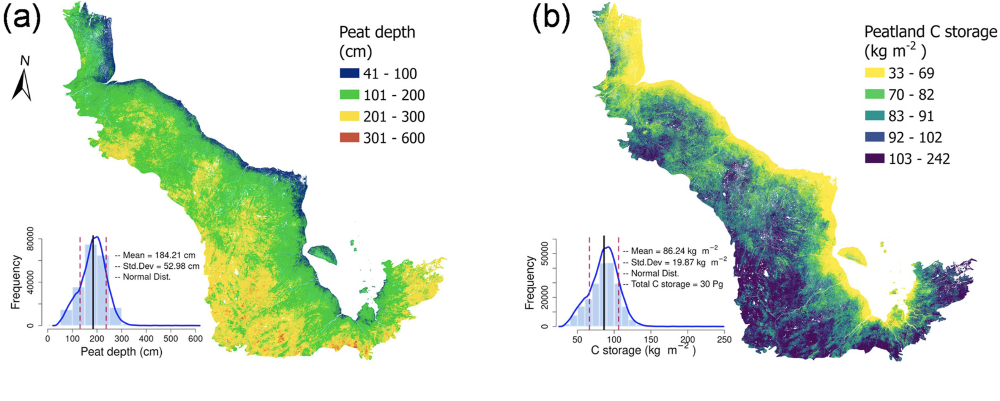

###### published in *'environmental research letters'*, 2022.03

# Abstract 

The Hudson Bay Lowlands (HBL) are recognized as the second largest peatland complex in the world. Due to variability in peat thickness across a large and heterogeneous landscape, the existing carbon (C) storage estimates for the HBL may contain large uncertainty. Here, we use geospatial variables that are associated with HBL peat formation, age, accumulation, and occurrence to understand the driving factors for peat depth variability and map peat depth and C storage at 30 m spatial resolution. The estimated average peat depth of HBL is 184(±48) cm with 90% of values falling between 89 and 264 cm. Based on the spatially explicit peat depth, the HBL total C storage is estimated to be 30(±6) Pg. Distance to the coastline is the most important indicator of peat depth where the depth increases with distance further away from Hudson Bay coastline, confirming that the time since peat formation is closely related to peat depth.[... more](https://agupubs.onlinelibrary.wiley.com/doi/full/10.1029/2024GL110679)

# Main results    

# Story behind

For high resolution prediction like 30 meters resolution or more higher, we could first divide them into small pieces and then using ensemble machine learning algorithms to predict each of them and then merge the small tiles into the whole one.

Totally cost ~10 hours for prediction. 

# Recommandation 

  - using Qgis to  "Raster" → "Miscellaneous" → "Split Raster"
  - using h2o to train ensemble model and then predict. 
  - nearest mean value to fill NA in landsat 8 from landsat 7. 
  

