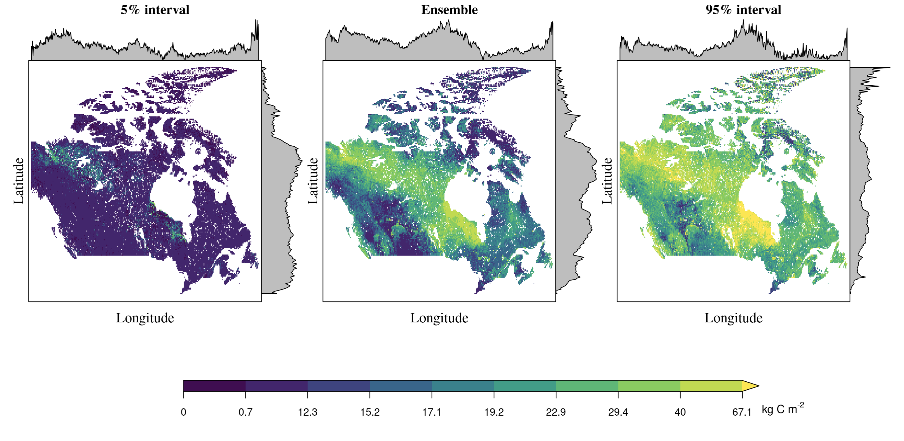

###### published in *'in Preparation'*, 2025.03

# Abstract 

Using multiple methods which come from different disciplines create a robust way to estimate SOC trend in response to climate change in Canada. In the future 

# Main results    

# Story behind

Highlight: 
    
    - using method from He to get C input to soil from vegetation
    - based on emergent constrain to get GPP in the future to calibrate data from CMIP
    - using ensemble machine learning to predict SOC, and splite into 10 cm interval for trainning, improve accuracy. set Peat map into categories to capture the peat extend. 
    - using C input and C output balance to simulate C transient dynamic
    - build relationship of turnover to climate variables (M4)
    - set different experiment to detect main driving factor to SOC 

# Recommandation 

  - card better than lu for soil res.
  - not use deepl for regression problem, not good. 
  - using SOCD to direct predict future SOCD to avoid systemetical bias. 
  
  

