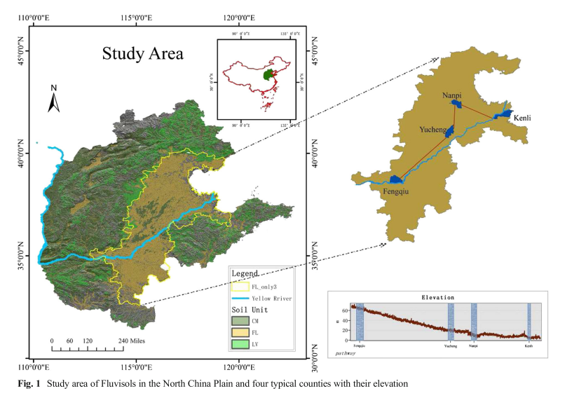

# Abstract 

## Aims
Try to detect the spatiotemporal dynamics and the
controlling factors of soil organic carbon (SOC) in the
North China Plain (NCP) over the last 30 years:
1980s-2010s.    

## Methods 
We investigated the SOC evolution by com-
piling data from 32 published papers during the last
30 years. Then we examined the spatial pattern and
controlling factors by analysing a two-period sampling
observations (1980s and 2010s) and multiple explana-
tory variables in four typical counties.[... more](https://link.springer.com/article/10.1007/s11104-016-2803-7)

# Main results 

